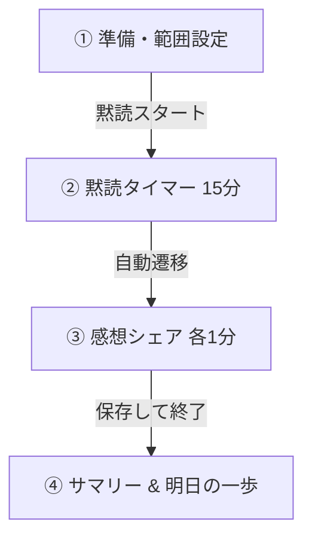

# 朝読み（asayomi） 利用者マニュアル

「朝読み（asayomi）」は、毎朝オンライン（oviceなど）で実施する読書会の進行をスムーズにし、読書の継続と参加者の相互理解を支援するためのWebアプリケーションです。

公開URL: **[https://asayomi.pages.dev](https://asayomi.pages.dev)**
*(データはすべて各自のブラウザ内にのみ保存されます。サーバーには送信されません)*

---

## 1. 読書会の基本的な流れ（約30分）

本ツールは、以下の30分の進行フローに対応しています。

| ステップ | 所要時間 | 行うこと | ツールの役割 |
| :--- | :--- | :--- | :--- |
| **① 準備・範囲設定** | 約 2 分 | 本日の開始・終了ページと、「今日の問い（お題）」を設定します。 | 開始ページの自動入力、スライダーでの範囲設定 |
| **② 黙読** | 15 分 | 各自マイクをミュートにし、集中して本を読みます。 | 大画面カウントダウンタイマー、終了30秒前のアラート |
| **③ 感想シェア** | 約 10 分 | 順番に1人1分ずつ、今日読んだ部分の感想を話します。 | 話者順の自動生成・シャッフル、1分タイマー、リアクション集計、ひとことメモ |
| **④ サマリー** | 約 2 分 | 今日の読書量と全体の進捗を確認し、明日の一歩を保存します。 | 進捗バー表示、ストリーク（連続日数）カウント、明日の一歩の記録 |

---

## 2. 各画面の機能と操作方法

### ① ホーム（セッション準備）
読書会を開始するための設定を行う画面です。

*   **本の情報**: 読んでいる本の「タイトル」「著者名」「総ページ数」を表示します。新しい本を登録すると、以前の本は自動的に「中断 (paused)」として保存されます。
*   **読む範囲（ページ）の設定**: 
    *   開始ページは、前回終了したページが自動入力されます。
    *   終了ページは、スライダーまたは「＋」「－」ボタンで直感的に調整できます。
*   **今日の問い**: 本日の読書中に意識したいテーマ（お題）を設定します。プリセットから選択するか、自由に入力できます。
*   **黙読スタート**: 設定が終わったらボタンを押し、黙読タイマーを開始します。

### ② 黙読タイマー
黙読時間を計測するタイマー画面です。

*   **大画面表示**: オンラインで画面共有した際、全員が見やすいように大きな数字でカウントダウンします。
*   **残り時間調整**: 「＋5分」「－5分」ボタンで時間を調整できます（既定は15分）。
*   **視覚的アラート**: 残り30秒になると背景色が赤系に変化し、終了が近づいていることを優しく知らせます。
*   **自動遷移**: タイマーが0になると、自動的に「感想シェア」画面に切り替わります。

### ③ 感想シェア
読んだ箇所の感想や気づきを話し合う画面です。

*   **話者の順番**: 登録されている参加者が一覧表示されます。「順番をシャッフル」ボタンでランダムに並び替えることができます。
*   **話者ハイライトと1分タイマー**: 
    *   現在話している人の名前が大きくハイライトされ、1分のカウントダウンが始まります。
    *   話し終わったら「次の人へ」ボタンを押し、順番を進めます。
*   **聞き手リアクション**: 
    *   話者の感想に対して、「共感」「なるほど」「発見」ボタンをタップしてリアクションを集計できます（フェーズ1では進行役が代理でタップします）。
*   **ひとことメモ**: 
    *   話者が話した内容の要約やキーワードを、その場で「メモ欄」に入力して記録できます。

### ④ サマリー（クロージング）
本日のセッションを振り返り、記録を保存する画面です。

*   **本日の成果**: 今日読んだページ数と、本全体に対する進捗率（％）をバーで視覚的に表示します。
*   **ストリーク（連続開催日数）**: 毎日の継続日数が表示され、読書のモチベーションを高めます。
*   **明日の一歩**: 読書を通じて得た気づきから、「明日実践すること」をアイコン（試す / 人に話す / 書き留める / もう一度読む）から選んで記録します。
*   **保存して終了**: ボタンをクリックすると、今日の記録が保存され、ホーム画面に戻ります。

---

## 3. 便利な応用機能

### 📖 履歴の確認
ヘッダーの「📖 履歴」ボタンから、これまでの読書会の軌跡をいつでも振り返ることができます。

1.  **全体集計**: 累計のセッション数、合計読書ページ数、各参加者の感想発表回数などの統計を表示します。
2.  **本ごとの軌跡**: これまでに登録・読了した本の一覧と、それぞれの進捗バーを表示します。
3.  **開催カレンダー**: 読書会を行った日がカレンダー上に視覚的にマークされます。
4.  **セッション一覧**: 過去の各セッションの「日付」「読む範囲」「問い」「リアクション数」「ひとことメモ」を詳細に確認できます。

### ⚙︎ データ管理（バックアップと移行）
ヘッダーの「⚙︎ データ管理」ボタンから、データの保存や編集ができます。

*   **設定と履歴の保存（エクスポート）**:
    現在ブラウザに保存されているすべてのデータ（本、参加者、履歴）を、一つの JSON ファイル（`asayomi_YYYY-MM-DD.json`）としてパソコンに保存します。
*   **設定と履歴の読込（インポート）**:
    保存した JSON ファイルを選択して読み込みます。パソコンの乗り換え時や、別のブラウザにデータを移行したい場合に便利です。
    *(注意: 読み込みを行うと、現在のブラウザのデータは上書きされます)*
*   **参加者の編集**: 参加者の名前やアイコン（絵文字）を追加・削除できます。
*   **本の編集**: 登録している本の一覧の編集、新しい本の追加が行えます。

---

## 4. 別のPCで使う（ファイルコピー）

本ツールは外部のサーバーやデータベースと通信せず、完全にローカル環境（ブラウザ）で動作します。

1.  `asayomi` フォルダごと別のPCにコピー（USB、共有ドライブ等）します。
2.  コピー先のPCで `index.html` をダブルクリック（またはブラウザにドラッグ＆ドロップ）するだけで、そのまま使用できます。
3.  進捗データや参加者情報を引き継ぎたい場合は、元のPCで「**設定と履歴の保存**」を行い、作成されたJSONファイルを新しいPCの「**設定と履歴の読込**」から読み込ませてください。
